

  

<h1 style="text-align: center;">
  Desafio Jueri Semijoias
</h1>

<a href="#instructions" style="margin: 5px 0;">
  Ver instruções
</a>

<h3>
  - Layout do projeto
</h3>

  - Página principal

<video width="400" controls>
  <source src="./views/assets/video/dashboard.mp4" type="video/mp4">
  <source src="./views/assets/video/dashboard.ogg" type="video/ogg">
</video>

  - Login

  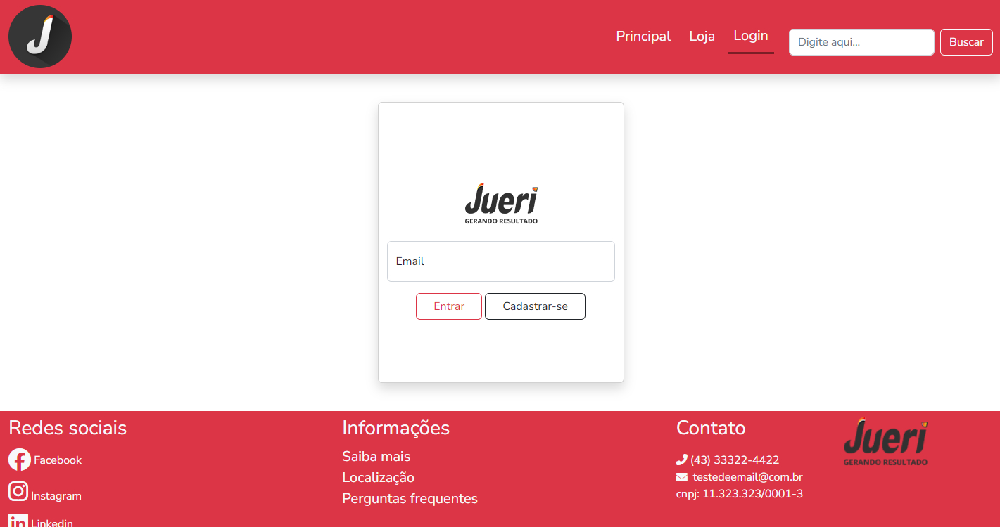

  - Cliente logado 

  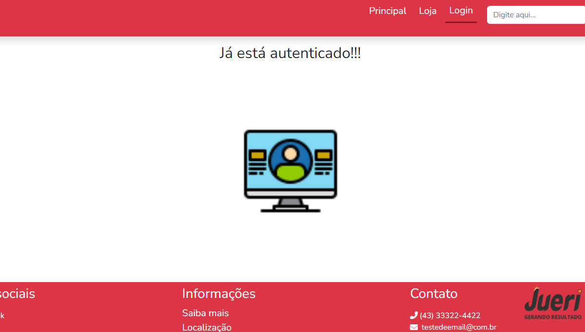

  - Cadastro de clientes 

  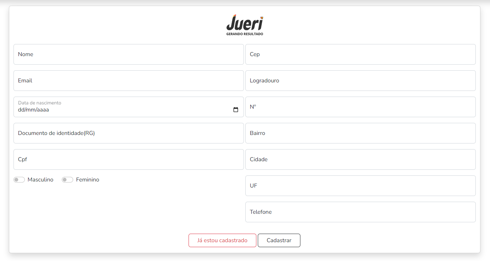

  - Erro ao cadastrar um cliente preservando os campos preenchidos

  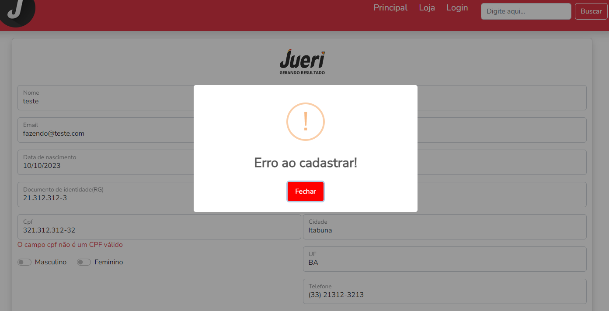

  - Erros genéricos ao tentar cadastrar informações inválidas preservando os campos preenchidos

  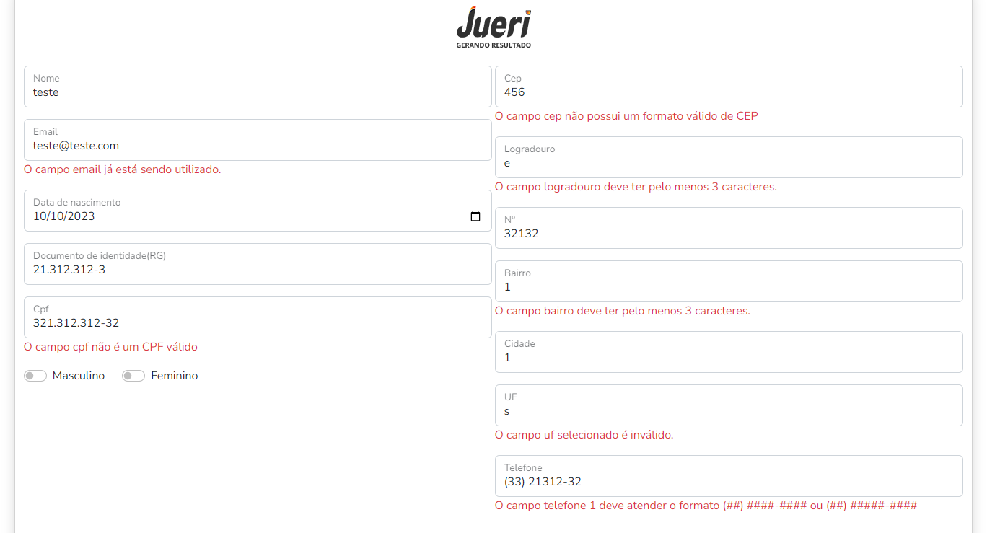

  - CEP com autocomplete dos campos via api <code>viacep api</code> 
  <a href="https://viacep.com.br/">viacep.com.br</a>

  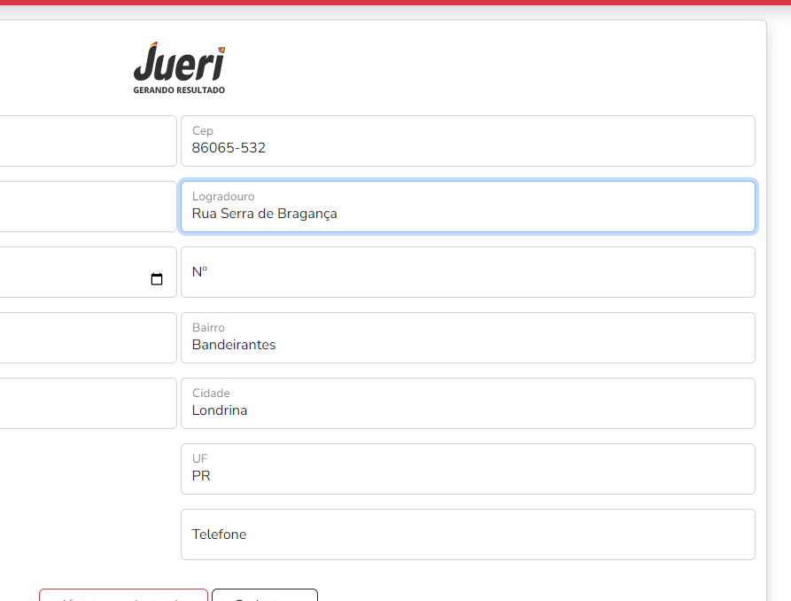

  - Cliente cadastrado com sucesso

  

  - Loja se autentificação

<video width="400" controls>
  <source src="./views/assets/video/shop.mp4" type="video/mp4">
  <source src="./views/assets/video/shop.ogg" type="video/ogg">
</video>

  - Loja com autentificação

<video width="400" controls>
  <source src="./views/assets/video/shop-auth.mp4" type="video/mp4">
  <source src="./views/assets/video/shop-auth.ogg" type="video/ogg">
</video>

  - Selecione o produto para adicionar no carrinho

  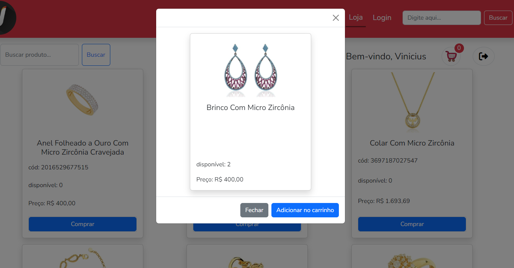

  - Mensagem de alerta do produto adicionado ao carrinho.
  Biblioteca: <code>sweetalert</code>  
  <a href="https://sweetalert2.github.io/#examples">
  Sweetalert.io
  </a>

  

  - Filtro de produtos

<video width="400" controls>
  <source src="./views/assets/video/search-products.mp4" type="video/mp4">
  <source src="./views/assets/video/search-products.ogg" type="video/ogg">
</video>

  - Carrinho de compras vazio

  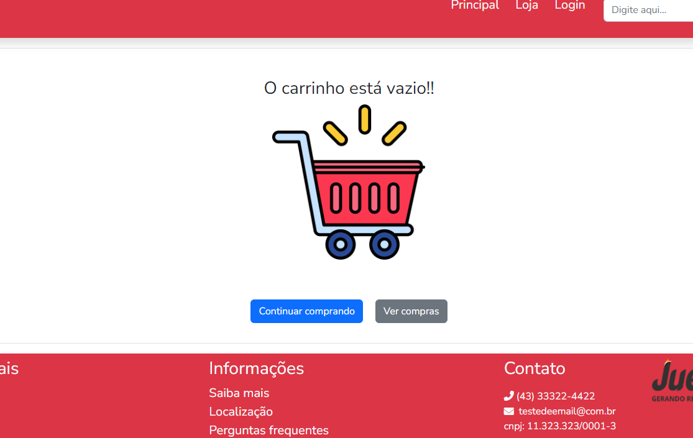

  - Carrinho de compras

  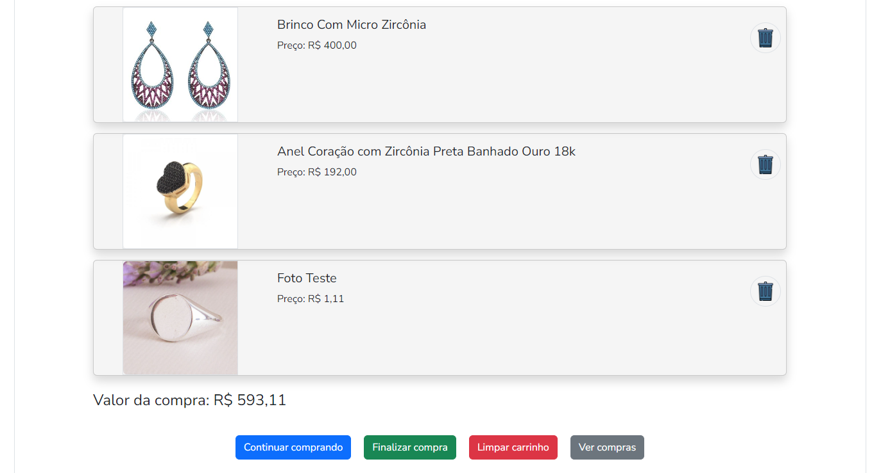

  - Remover um produto do carrinho

  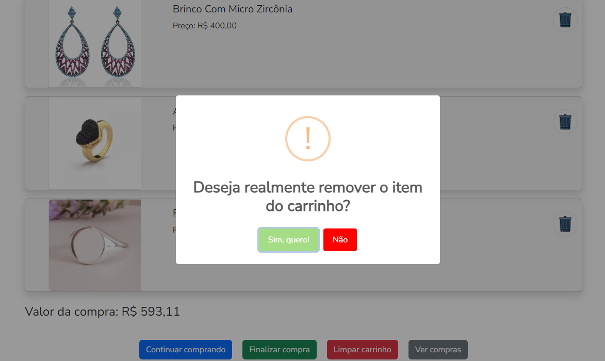

  - Remover todos os produtos do carrinho

  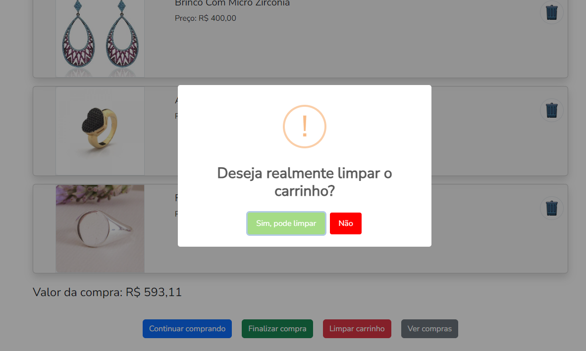

  - Compra efetuado com sucesso

  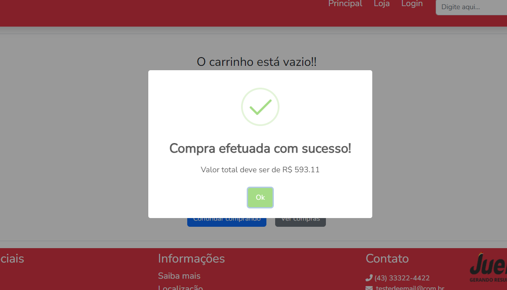

  - Ver minhas compras

  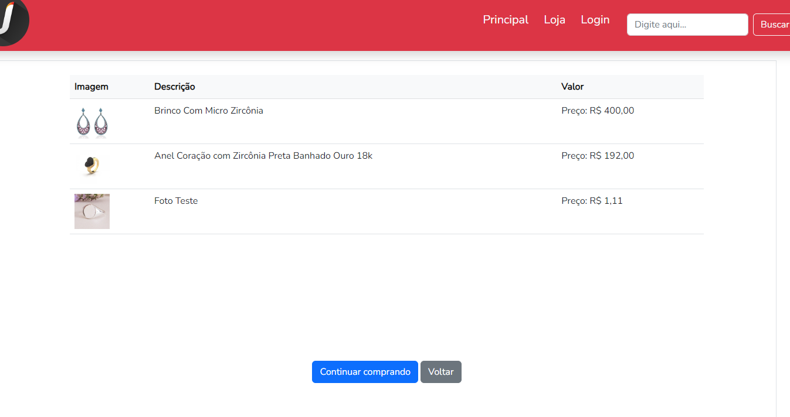

