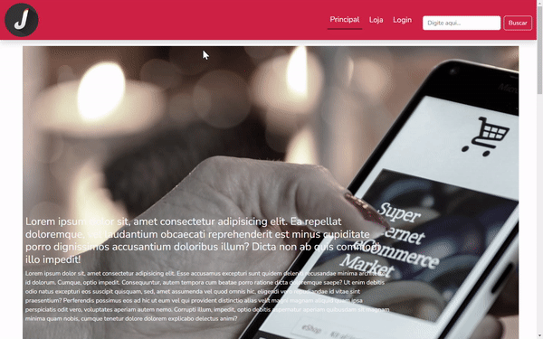
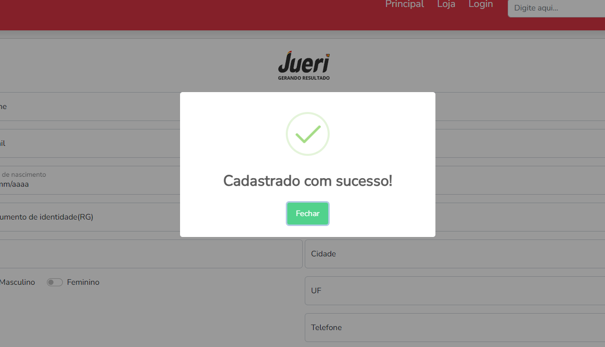

  

<h1 style="text-align: center;">
  Desafio Jueri Semijoias
</h1>

<a href="#instructions" style="margin: 5px 0;">
  Ver instruções
</a>

<h3>
  - Layout do projeto
</h3>

  - Página principal

  

  - Login

  

  - Cliente logado 

  

  - Cadastro de clientes 

  

  - Erro ao cadastrar um cliente preservando os campos preenchidos

  

  - Erros genéricos ao tentar cadastrar informações inválidas preservando os campos preenchidos

  

  - CEP com autocomplete dos campos via api <code>viacep api</code> 
  <a href="https://viacep.com.br/">viacep.com.br</a>

  

  - Cliente cadastrado com sucesso

  

  - Loja sem autentificação

  

  - Loja com autentificação

  

  - Selecione o produto para adicionar no carrinho

  

  - Mensagem de alerta do produto adicionado ao carrinho.
  Biblioteca: <code>sweetalert</code>  
  <a href="https://sweetalert2.github.io/#examples">
  Sweetalert.io
  </a>

  

  - Filtro de produtos

  

  - Carrinho de compras vazio

  

  - Carrinho de compras

  

  - Remover um produto do carrinho

  

  - Remover todos os produtos do carrinho

  

  - Compra efetuado com sucesso

  

  - Ver minhas compras

  

<h1 id="instructions">
  Instruções 
</h1>

<h3>
  Docker
</h3>

  Para iniciar o projeto com docker, certifique-se de que tenha o docker instalado na sua máquina. Caso contrário, você pode optar por instalá-lo visitando a página oficial <a href="https://docs.docker.com/engine/install/">docs.docker.com</a> e seguir o passo-a-passo da instalação conforme o seu sistema operacional

<h4>
  Comandos para iniciar o projeto com docker
</h4>

ver os containers em execução: `docker ps`

baixar a imagem e iniciar o projeto: `docker compose up -d --build`

depois disso, caso não ocorra nenhum erro, na porta `localhost:80` do seu navegador irá executar o projeto.

certifique-se de que a porta `:80` esteja disponível na sua máquina!

## Caso não queira usar o Docker para iniciar o projeto, siga o seguinte passo:

- Inicie o vscode no diretório raiz do projeto;

- Abra o terminal `Ctrl + j` e execute o comando: `php -S localhost:<porta>` substitua `<porta>` conforme preferir;

  - Dicas de portas: `8080`, `8800`, `8000`, `5000`...

***OBS: é preciso ter o php intalado na sua máquina. Para saber disso digite no terminal o comando: `php -v`

## .env

- Antes de começar a usar o sistema, crie um arquivo `.env` com as variáveis de ambiente para que as requisições com a api sejam bem sucedidas.

- Veja os exemplos das variáveis no arquivo `.env.example`

### Feito isso o projeto estará pronto para uso!!! 
